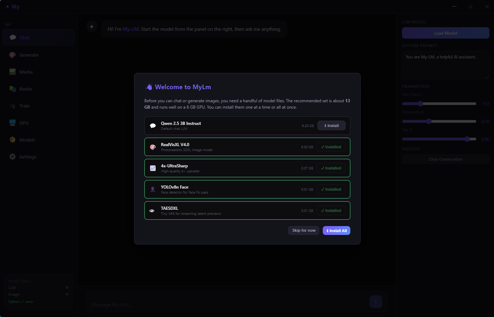
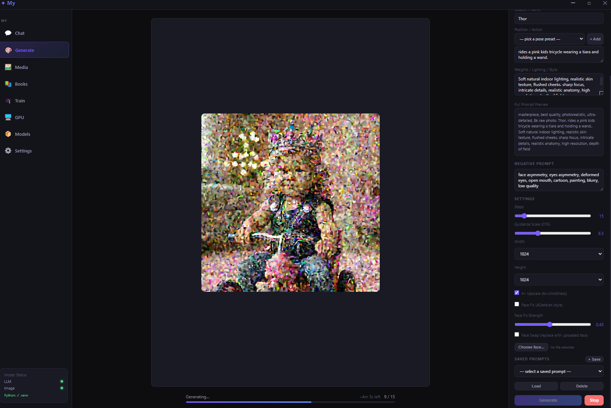
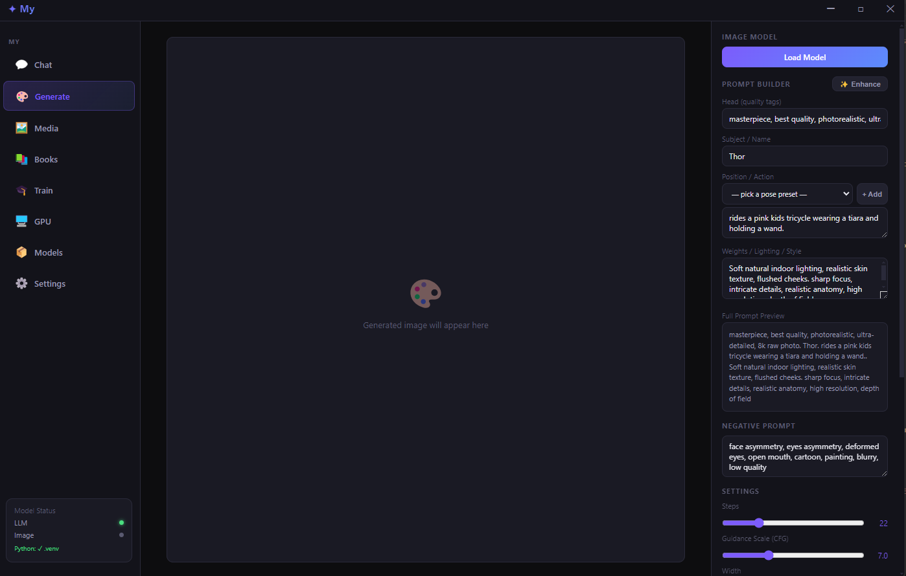
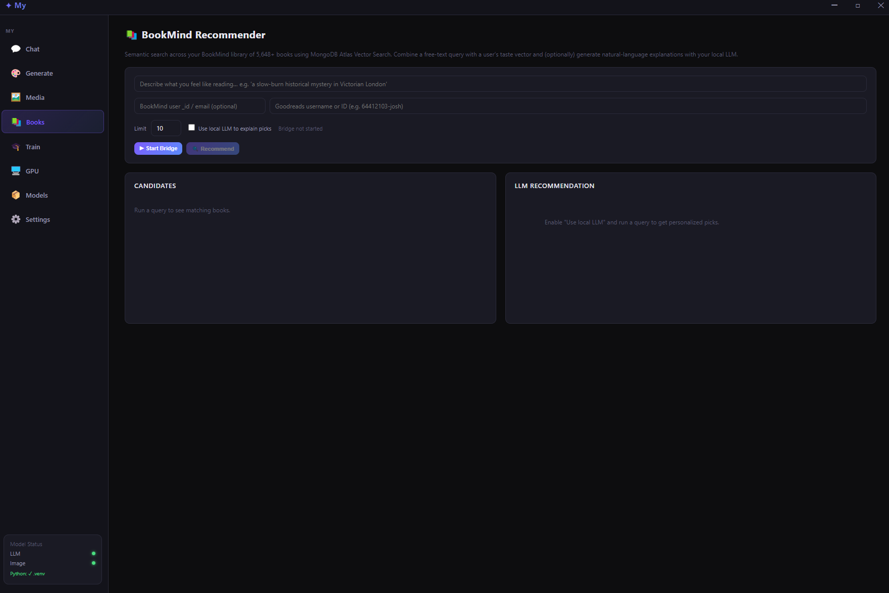
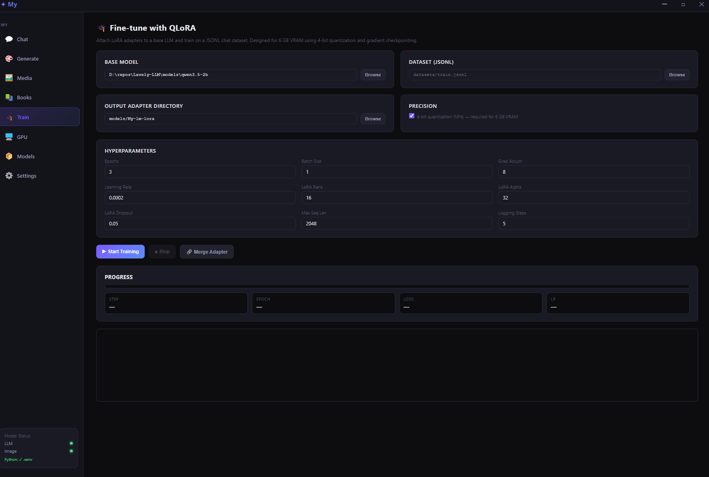
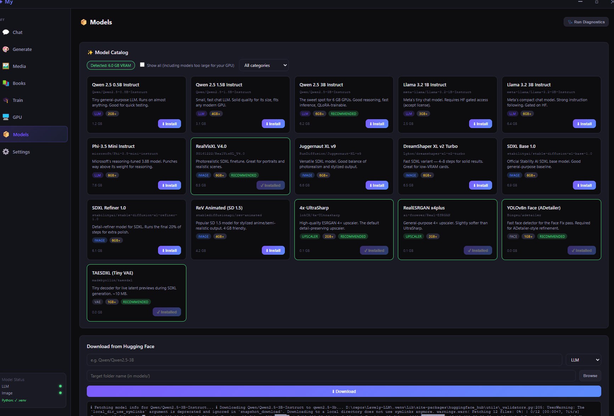
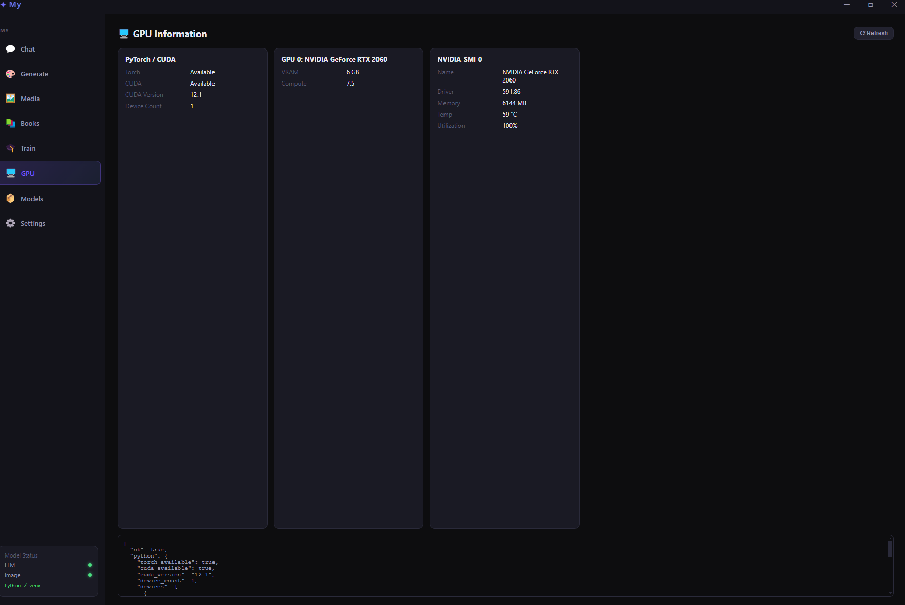

<div align="center">

# My-LM

**A local, all-in-one playground for running, fine-tuning, and generating with open-weight models — on a single GPU.**

[](LICENSE)
[](https://www.python.org/downloads/)
[](https://nodejs.org/)
[](https://www.electronjs.org/)
[](https://pytorch.org/)
[](CONTRIBUTING.md)

[**Install**](#-quick-start) · [**Docs**](docs/) · [**Features**](#-what-can-it-do) · [**Architecture**](docs/architecture.md) · [**Contributing**](CONTRIBUTING.md)



</div>

---

## What is My-LM?

My-LM is a **dark-mode Electron app + Python backend** that bundles four things you usually have to run separately:

- 💬 a **chat LLM** (Qwen 2.5 / Llama 3.2 / Phi-3.5) with streaming and a system prompt
- 🎨 an **SDXL image generator** with live latent previews, a face detailer, and 4× upscaling
- 📚 a **RAG book recommender** (BookMind) over MongoDB Atlas Vector Search
- 🧠 a **QLoRA fine-tuning loop** with live loss/epoch metrics and one-click adapter merge

Everything runs **locally**, on your hardware. No tokens, no rate limits, no data leaving your machine.

Designed and tested on a **6 GB RTX 2060** — every feature has been tuned to fit that VRAM budget — but it scales up gracefully. Works on Windows, Linux, and (CPU/MPS) macOS.

---

## ✨ What can it do?

<table>
<tr>
<td width="50%" valign="top">

### 🎨 Generate images with live previews
SDXL with `compel` long-prompt support, structured prompt builder, ETA, saved prompt presets, and **streaming latent previews** every 2 steps via TAESDXL — watch the image materialize in real time.



</td>
<td width="50%" valign="top">

### 💬 First-class onboarding
Welcome modal detects which essential models you're missing (~13 GB total) and offers one-click install from Hugging Face. No CLI gymnastics, no `git lfs` errors.



</td>
</tr>
<tr>
<td width="50%" valign="top">

### 📚 BookMind — RAG book recommender
Semantic search over a MongoDB Atlas library using `$vectorSearch` on 384-dim embeddings, optionally blended with a user's stored taste vector, with **grounded LLM explanations** that can only mention books from the retrieved set.



</td>
<td width="50%" valign="top">

### 🧠 QLoRA fine-tuning, no notebook required
4-bit quantized base model + LoRA adapters, trainable on 6 GB VRAM. Live loss/epoch/LR metrics streamed from a `TrainerCallback`. **Merge Adapter** button fuses the LoRA back into the base model in one click.



</td>
</tr>
<tr>
<td width="50%" valign="top">

### 📦 GPU-aware model catalog
Curated picks across LLMs, SDXL/SD1.5, upscalers, face detectors, and preview VAEs. Detects your VRAM and **hides anything that won't fit** by default. Manual HF repo download with progress for everything else.



</td>
<td width="50%" valign="top">

### 🖥 GPU dashboard + diagnostics
Live `torch.cuda` info plus `nvidia-smi` output (memory, temperature, utilization). Sidebar status indicator shows LLM / Image / Python health at a glance.



</td>
</tr>
</table>

> **Also includes:** ADetailer-style face fix (YOLOv8 + SDXL img2img on each face, alpha-composited back), 4× ESRGAN upscaling tiled to fit 6 GB VRAM, image gallery with lightbox, persistent chat/prompt history, four standalone CLI tools.

See [docs/features.md](docs/features.md) for the full per-feature breakdown.

---

## 🚀 Quick start

**Prerequisites:** Python 3.10+, Node.js 18+, NVIDIA GPU + CUDA drivers, `nvidia-smi` on PATH.

```bash
git clone https://github.com/lavely/my-lm.git
cd my-lm

# Linux / macOS
./setup.sh

# Windows
setup.bat

# Launch
cd ui && npm start
```

The setup script creates `.venv`, installs CUDA-matched PyTorch wheels, installs the `mylm` package in editable mode, and builds the Electron UI. On first launch you'll see the **Install Models** modal pictured above.

For BookMind, copy `.env.example` to `.env` and fill in your MongoDB Atlas connection. Full setup details + troubleshooting are in [docs/installation.md](docs/installation.md).

---

## 📚 Documentation

| Doc                                          | What's in it                                       |
| -------------------------------------------- | -------------------------------------------------- |
| [docs/features.md](docs/features.md)         | Per-screen feature tour                            |
| [docs/installation.md](docs/installation.md) | Setup, model downloads, troubleshooting            |
| [docs/architecture.md](docs/architecture.md) | Process model, IPC, bridge protocol, memory budget |
| [docs/cli.md](docs/cli.md)                   | Standalone CLI tools (`scripts/`)                  |
| [docs/bookmind.md](docs/bookmind.md)         | BookMind RAG configuration                         |
| [docs/packaging.md](docs/packaging.md)       | Building installers                                |
| [docs/benchmarking.md](#-benchmarking)       | Agent benchmark harness                            |
| [CONTRIBUTING.md](CONTRIBUTING.md)           | How to contribute                                  |
| [SECURITY.md](SECURITY.md)                   | Reporting vulnerabilities                          |

---

## 🧱 Architecture at a glance

```text
┌─ Electron main (Node) ─────────────────────────────────┐
│   ├─ llmBridge   ──spawns──▶  python scripts/llm_bridge.py
│   ├─ imageBridge ──spawns──▶  python scripts/image_bridge.py
│   ├─ trainBridge ──spawns──▶  python scripts/train_bridge.py
│   ├─ bookBridge  ──spawns──▶  python scripts/book_bridge.py
│   └─ preload exposes a typed API as window.My
│                                                         │
│ Renderer (sandboxed) — vanilla TS + webpack             │
└─────────────────────────────────────────────────────────┘
```

Long-lived Python subprocesses exchange newline-delimited JSON over stdin/stdout. Screens can switch freely without interrupting any running operation.

```text
my-lm/
├── src/mylm/        Reusable Python library (pip-installable)
├── scripts/         Bridge + CLI entry points (spawned by Electron)
├── ui/              Electron app (TypeScript main + renderer)
├── tests/           pytest suite
├── datasets/        Example training data
└── docs/            Long-form documentation
```

`models/`, `outputs/`, and `benchmark_results/` are runtime-only and gitignored.

---

## 📏 Memory budget on 6 GB

The app is designed so no single step blows out VRAM:

- SDXL base pass uses `enable_model_cpu_offload()` to stream components on/off GPU
- Text encoders move to GPU only for `compel` prompt encoding, then back to CPU
- Face detailer **reuses the base pipe's weights** — no second SDXL load
- 4× upscale runs **tiled at 384 px** with 32 px overlap
- Training uses **4-bit NF4 quantization** + gradient checkpointing

> **Don't run chat + image + training simultaneously** — they each want the whole GPU.

---

## 📊 Benchmarking

My-LM includes a **multi-turn agent benchmark** (`scripts/agent_bench.py`) that measures LLM inference performance in agentic workloads — where context accumulates across turns and fixed KV windows can cause model reloads.

### What it measures

| Metric | Why it matters |
| ------ | -------------- |
| TTFT (time to first token) | Raw responsiveness per turn |
| TTFT slope (ms/turn) | How latency grows as context accumulates |
| Model reloads | Cold restarts caused by `num_ctx` changes |
| Swap events | macOS/Linux memory pressure detection |
| Peak RAM | KV cache memory footprint |
| Tool-call errors | Format reliability under different temperatures |
| Context tokens (final) | Context drift / trimming effectiveness |
| Task success rate | End-to-end completion |

### Tasks

- **`code_debugger`** — read buggy Python files, run tests, identify failures, write fixes. Context grows with each file read and test output.
- **`research_synth`** — read research documents, cross-reference findings, produce a structured synthesis. Context grows steadily with each doc.

### Quick start

```bash
# Dry-run — validate task definitions, no Ollama required:
python scripts/agent_bench.py --dry-run

# Quick run (2 tasks, 2 trials):
python scripts/agent_bench.py --models llama3.2:3b \
    --tasks code_debugger,research_synth --trials 2

# Full run (all tasks, 5 trials):
python scripts/agent_bench.py
```

Results are written to `benchmark_results/` as both JSON (raw data) and Markdown (formatted report). See the `--help` flag for all options.

---

## 🤝 Contributing

PRs welcome! [CONTRIBUTING.md](CONTRIBUTING.md) covers the dev loop, coding conventions, and how to run linters/tests locally. Be excellent to each other — see the [Code of Conduct](CODE_OF_CONDUCT.md).

Found a bug or have an idea? [Open an issue](https://github.com/lavely/my-lm/issues/new/choose) · Have a question? [Start a discussion](https://github.com/lavely/my-lm/discussions).

---

## 📝 License

[MIT](LICENSE) © 2026 Josh Lavely

<div align="center">
<sub>Built for tinkerers with modest GPUs and big curiosity.</sub>
</div>
