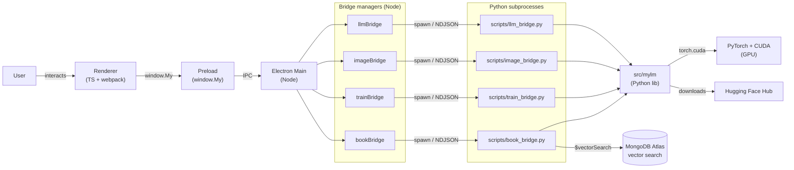

# My-LM System Architecture

This diagram is generated from [architecture.yaml](architecture.yaml) and rendered with Mermaid for instant viewing on GitHub. The same YAML is the input to the [VSDX skill](../../.github/skills/VISIO.md) for producing an editable Visio file.

## Notes

- **Bridges are long-lived**: the Node-side `*Bridge` modules each manage one Python subprocess for the lifetime of the app. Screen switches do not interrupt running ops.
- **Wire format**: newline-delimited JSON over stdin/stdout.
- **GPU contention**: chat / image / training all want the whole 6 GB. Don't run them concurrently.
- **BookMind path**: bookPy goes directly to MongoDB Atlas via `pymongo`'s `$vectorSearch`; mylm provides the embedding helpers.
