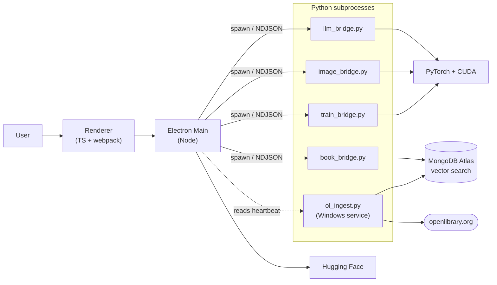

---
hide:
  - navigation
---

# My-LM

**A local, all-in-one playground for running, fine-tuning, and generating with open-weight models — on a single GPU.**

My-LM is a dark-mode Electron app + Python backend that bundles four things you usually have to run separately:

- :material-chat: a **chat LLM** (Qwen 2.5 / Llama 3.2 / Phi-3.5) with streaming
- :material-image: an **SDXL image generator** with live latent previews, face detailer, and 4× upscaling
- :material-book-open-page-variant: a **RAG book recommender** (BookMind) over MongoDB Atlas Vector Search
- :material-school: a **QLoRA fine-tuning loop** with live metrics and one-click adapter merge

Everything runs **locally**, on your hardware. Designed and tuned for a **6 GB RTX 2060** but scales up gracefully.

[:octicons-arrow-right-24: Install in 3 commands](installation.md){ .md-button .md-button--primary }
[:octicons-mark-github-16: View on GitHub](https://github.com/Azayzel/my-lm){ .md-button }

---

## Where to go next

-   :material-rocket-launch: **[Installation](installation.md)**

    Prerequisites, one-shot setup script, the first-run model download
    wizard, and `.env` configuration.

-   :material-feature-search: **[Features](features.md)**

    Per-screen tour: Chat, Generate, Books, Train, Models, GPU dashboard,
    plus the face detailer and 4× upscale internals.

-   :material-sitemap: **[Architecture](architecture.md)**

    Process model, bridge protocol, IPC surface, repo layout, and the
    GPU memory budget that keeps everything fitting in 6 GB.

-   :material-database-search: **[BookMind (RAG)](bookmind.md)**

    Atlas Vector Search setup, embedding model, schema expectations,
    and the two-stage QLoRA fine-tune that personalizes recommendations.

-   :material-database-arrow-down: **[OpenLibrary ingest](ol_ingest.md)**

    Continuous crawler that fills the BookMind library — Windows
    service install, monitoring, and tuning guide.

-   :material-console: **[CLI tools](cli.md)**

    Standalone scripts for chat, image generation, training, model
    download, ingest, and the agent benchmark.

-   :material-package-variant: **[Packaging](packaging.md)**

    Building Windows / Linux / macOS installers with electron-builder.

-   :material-graph: **[System diagram](diagrams/architecture.md)**

    Live Mermaid render of how all the pieces fit together.

---

## Architecture at a glance

Long-lived Python subprocesses exchange newline-delimited JSON over stdin/stdout. The OpenLibrary ingest runs out-of-process as a Windows service and surfaces its status to the UI via a heartbeat file.

---

## Memory budget on 6 GB

The app is designed so no single step blows out VRAM:

| Step | Strategy |
|---|---|
| SDXL base pass | `enable_model_cpu_offload()` streams components on/off GPU |
| Text encoders | Move to GPU only for `compel`, then back to CPU |
| Face detailer | Reuses base pipe's weights — no second SDXL load |
| 4× upscale | Tiled at 384 px with 32 px overlap |
| QLoRA training | 4-bit NF4 quantization + gradient checkpointing |

!!! warning "Don't run chat + image + training simultaneously"
    Each of these steps wants the whole GPU.
